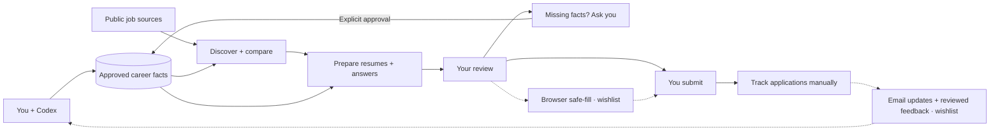

# Grounded Apply

**A local-first job-search assistant that keeps your applications grounded in facts.**

Build a reusable career profile, find roles on public company boards, and prepare
resumes and answers using facts you have reviewed. Codex handles the commands;
you review the facts and materials, choose where to apply, and submit.

**Status: experimental alpha · broader development paused.** The supervised local
workflow is implemented and tested on macOS with Python 3.12. It is useful for
reviewed application preparation, but it has not demonstrated lower user effort
in a comparative trial. Expect setup and review work. This repository shares the
working foundation and its unfinished design, with no promised delivery schedule.

## What you can do

- See retained facts by topic, review chosen facts or batches, and reuse approved evidence.
- Start from text, PDF or LaTeX, keep wrapped publications together, or use guided questions.
- Find public company boards from role/location preferences, then discover jobs on
  Greenhouse, Ashby, Lever, Workable and Netflix routes, with location filters and visible gaps.
- Compare quoted job requirements with your evidence and see missing information.
- Prepare traceable PDF resumes with research context and career answers, individually or as a batch.
- Resume saved searches, review new drafts, and track applications you submit.

Resume preparation selects and orders approved wording. Missing or unsupported
facts become questions. The tool does not invent achievements or predict hiring.

## Get started with Codex

Clone the repository and open its folder in Codex:

```bash
git clone https://github.com/chenyugoal/grounded-apply.git
cd grounded-apply
```

Then ask:

> Use $grounded-apply to help me set up my career profile. Show me the facts for
> review, then help me prepare an application for a role I choose.

Codex follows the [first-session workflow](docs/CODEX_WORKFLOW.md) and handles
identifiers, command syntax, and review steps. Keep your resume and personal data
outside this repository. You choose which facts may be stored and approve them
before they can support generated materials.

The base CLI needs **Python 3.12+** and a POSIX shell. The CLI itself needs no
model API key; using Codex requires your own Codex access. No package installation
is needed to inspect the CLI:

```bash
./scripts/gapply --help
./scripts/gapply doctor --materials --json
```

The PDF prerequisite check reports presence only and needs no profile.
See the [setup guide](docs/QUICKSTART.md#start) for optional
materials, TeX and backup dependencies. PDF input needs `pypdf`; PDF output also
needs a local TeX installation. Native Windows support and the full hosted
Linux/macOS verification matrix remain unverified. See the
[release notes](CHANGELOG.md) for the tested scope and limits.

Already have a profile? Ask Codex, “What should I work on next in my job search?”
For recurring discovery, use the [daily setup guide](docs/DAILY_QUICKSTART.md).

## The product we envisioned

One conversation to maintain a career memory, discover relevant work, and review
prepared applications. New answers would improve that memory only with your
approval. The full vision includes capabilities that are still on the wishlist:



Solid paths describe the current supervised workflow; dashed paths are the future
vision. Tracking currently requires manual updates. Even in the full vision,
login, sensitive answers, signatures, and final submission remain human actions.
The [figure brief](docs/PRODUCT_VISION.md) describes the intended schematic.

## Roadmap and wishlist

This is a record of scope, not a promise to finish every item.

| Area | Supported today | Wishlist / unfinished |
|---|---|---|
| Career memory | Text, selectable-text PDF and static LaTeX intake; reviewed facts; optional guided questions | OCR, DOCX, richer interpretation and saved interview progress |
| Discovery | Configured Greenhouse, Ashby, Lever and Workable boards; bounded Netflix discovery; Codex-assisted source finding | Broader coverage, more connectors and cross-source deduplication |
| Matching | Requirement-to-evidence comparisons and explicit gaps | Semantic ranking and richer employer research |
| Materials | Select and order approved wording; validated PDF resumes; grounded career answers; batches | Verified semantic rewriting, more templates and cover letters |
| Repeat use | Saved searches, resumable draft queues, daily execution when externally triggered, manual application history | Integrated setup, GUI and email/calendar updates |
| Applying | Review and export materials for manual use | Visible browser safe-fill; final submission stays with you |
| Data care | Private local storage; optional encrypted database backup/restore; whole-portable-home deletion | Document deduplication, automatic retention and larger-history performance |

See the [detailed roadmap](docs/ROADMAP.md) for engineering status and the
[release acceptance guide](docs/RELEASE_READINESS.md) for uncompleted product validation.

## Know the boundaries

Discovery covers configured sources; it does not match the market coverage of
LinkedIn or Indeed. You can also supply job text and its URL. Daily searches need
an authorized external wake-up mechanism; the CLI installs no background process.
Browser filling, automatic semantic rewriting, and outbound messages are not
available. Final submission is always your action.

PDF/LaTeX extraction needs review, especially for wrapped publications, reading
order and unsupported sections. Storage is bounded to a 256 MiB database;
backup/restore near that limit used about 2.3 GiB of memory in synthetic testing.
Keep external source files and exported copies separately backed up.

Your profile is stored locally, outside Git. Selected evidence and history are
retained in the private database; original source files and exported copies are
separate. Content shown to Codex is subject to your Codex configuration—local
storage does not mean the conversation stays on your device. Sensitive answers
are never inferred, and permission to use an answer is separate from permission
to retain it. See the [privacy and storage reference](docs/REFERENCE.md#trust-and-privacy-contract).

## Documentation

| I want to… | Start here |
|---|---|
| Use Grounded Apply through conversation | [Codex workflow](docs/CODEX_WORKFLOW.md) |
| Set up dependencies or inspect CLI examples | [Quickstart](docs/QUICKSTART.md) |
| Import a complete CV or build a profile by questions | [Profile setup](docs/PROFILE_SETUP.md) |
| Configure job sources and review their limits | [Job discovery](docs/JOB_DISCOVERY.md) |
| Discover jobs and prepare drafts together | [Saved searches](docs/SEARCH_RUNS.md) |
| Run and review a daily search | [Daily setup](docs/DAILY_QUICKSTART.md) |
| Understand backup, deletion, and import contracts | [Detailed reference](docs/REFERENCE.md) |
| Resume development | [Next task](docs/SESSION_HANDOFF.md#next-exact-task) · [Current verification](docs/SESSION_HANDOFF.md#current-verification) |
| Contribute or prepare a release | [Contributing](CONTRIBUTING.md) · [Release readiness](docs/RELEASE_READINESS.md) |

Read the [design](GROUNDED_APPLY_DESIGN.md) for the longer-term direction and
[security policy](SECURITY.md) for private vulnerability reporting.
Licensed under [Apache 2.0](LICENSE).
